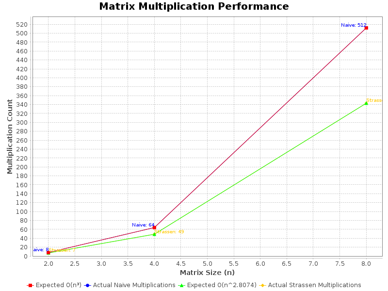

# **Lab 1: Strassen Multiplication**
### **EN.605.620 - Algorithms for Bioinformatics**
**Developer:** AJ Book  
**Instructor:** Dr. Rubey

---

## **Overview**
This project implements and compares two matrix multiplication algorithms:
1. **Naive Matrix Multiplication** (**O(n³)**)
2. **Strassen's Algorithm** (**O(n^2.8074)**)

The objective is to evaluate the efficiency of Strassen’s algorithm compared to the standard naive approach. The program:
- Measures execution time and multiplication counts.
- Verifies the correctness of Strassen’s algorithm against naive multiplication.
- Generates formatted tables of results.
- Produces performance graphs comparing expected and actual complexity trends.



---

## **Enhancements and Features**
- **Performance Metrics:** Measures runtime and number of multiplications for both algorithms.
- **Automated Comparisons:** Checks whether Strassen and naive multiplication results match.
- **Graph Generation:** Plots multiplication counts and expected complexity curves.
- **Debug Mode:** Enables verbose logging for tracking execution details.
- **Flexible File Handling:**
   - **Input files are read from the `input/` directory.**
   - **Output files (logs and plots) are stored in the `output/` directory.**
   - **Supports user-specified filenames for logs and plots via command-line arguments.**
- **Matrix Operations:** Supports addition, subtraction, and splitting/merging for Strassen’s algorithm.

---

## **Project Structure**
The project is organized into packages based on functionality:
```
.
├── input/                  # Input matrices
│   ├── LabStrassenInput.txt
├── output/                 # Output results and performance plots
│   ├── matrix_comparison.txt
│   ├── matrix_performance.png
├── src/
│   ├── main/
│   │   ├── java/
│   │   │   └── edu/jhu/algos/
│   │   │       ├── Main.java                # Entry point
│   │   │       ├── algorithms/
│   │   │       │   ├── MatrixMultiplier.java    # Abstract class for multiplication
│   │   │       │   ├── NaiveMultiplication.java # Naive O(n³) multiplication
│   │   │       │   ├── StrassenMultiplication.java # Strassen O(n^2.8074) algorithm
│   │   │       ├── compare/
│   │   │       │   ├── ComparisonDriver.java      # Runs and logs comparisons
│   │   │       │   ├── ComparisonTableGenerator.java # Generates formatted output tables
│   │   │       │   ├── CurveFitter.java           # Fits performance trends
│   │   │       │   ├── PerformanceRecord.java     # Data structure for storing performance results
│   │   │       ├── io/
│   │   │       │   ├── MatrixFileHandler.java     # Reads matrix input files
│   │   │       ├── models/
│   │   │       │   ├── Matrix.java                # Matrix representation
│   │   │       ├── operations/
│   │   │       │   ├── MatrixOperations.java      # Add, subtract, split, merge matrices
│   │   │       ├── utils/
│   │   │       │   ├── DebugConfig.java           # Handles debug mode
│   │   │       │   ├── MatrixUtils.java           # Helper functions for matrices
│   │   │       │   ├── MatrixValidator.java       # Validates matrices
│   │   │       │   ├── PerformanceMetrics.java    # Handles execution timing
│   │   │       ├── visualization/
│   │   │       │   ├── GraphGenerator.java        # Generates performance plots
│   ├── test/                                        # Unit tests
├── pom.xml                 # Maven build file
└── README.md               # Project documentation (this file)
```

---

## **Key Components**
### **1. Main Execution (`Main.java`)**
- Reads input matrices.
- Calls `ComparisonDriver.java` to run the multiplication algorithms.
- Optionally enables debug mode (`--debug`).
- Handles `--plot` flag to generate performance graphs.

### **2. Comparison (`ComparisonDriver.java`)**
- Runs both naive and Strassen multiplication.
- Measures execution time and multiplication count.
- Validates correctness of Strassen’s results against naive multiplication.
- Writes results to `matrix_comparison.txt`.

### **3. Matrix Representation (`Matrix.java`)**
- Stores matrix data as a `2D int array`.
- Provides helper functions for accessing and modifying matrix elements.

### **4. Matrix Operations (`MatrixOperations.java`)**
Implements core matrix functions needed for Strassen’s algorithm:
- **Addition:** Used in Strassen’s intermediate calculations.
- **Subtraction:** Used for computing submatrices.
- **Splitting:** Divides a matrix into four submatrices.
- **Merging:** Combines four submatrices into a single matrix.

### **5. Multiplication Algorithms**
#### **Naive Multiplication (`NaiveMultiplication.java`)**
Implements the standard **O(n³)** algorithm using three nested loops:
```text
for (int i = 0; i < n; i++) {
    for (int j = 0; j < n; j++) {
        for (int k = 0; k < n; k++) {
            result[i][j] += A[i][k] * B[k][j];
        }
    }
}
```
Each element in the result matrix is computed using row-by-column multiplication.

#### **Strassen Multiplication (`StrassenMultiplication.java`)**
Strassen’s method reduces multiplication operations by recursively dividing the matrices into smaller submatrices and using **seven** multiplication steps instead of eight.

**Step 1: Divide matrices into four submatrices**
Given matrix `A` and `B`, split them into:
```
A = | A11  A12 |    B = | B11  B12 |
    | A21  A22 |        | B21  B22 |
```
**Step 2: Compute seven intermediate matrices**
```
M1 = (A11 + A22) * (B11 + B22)
M2 = (A21 + A22) * B11
M3 = A11 * (B12 - B22)
M4 = A22 * (B21 - B11)
M5 = (A11 + A12) * B22
M6 = (A21 - A11) * (B11 + B12)
M7 = (A12 - A22) * (B21 + B22)
```
**Step 3: Compute result submatrices**
```
C11 = M1 + M4 - M5 + M7
C12 = M3 + M5
C21 = M2 + M4
C22 = M1 - M2 + M3 + M6
```
**Step 4: Merge `C11, C12, C21, C22` to form final matrix**

Strassen’s method replaces eight multiplications with seven at each recursion level, leading to an asymptotic complexity of **O(n^2.8074)**.

---

## **Compiling and Running**
### **With Maven**
```sh
mvn clean package
java -jar target/MatrixMultiplication-1.0-SNAPSHOT.jar LabStrassenInput.txt
```
Enable debug mode:
```sh
java -jar target/MatrixMultiplication-1.0-SNAPSHOT.jar LabStrassenInput.txt --debug
```
Generate performance graphs:
```sh
java -jar target/MatrixMultiplication-1.0-SNAPSHOT.jar LabStrassenInput.txt --plot
```

### **Without Maven**
#### **Compile all Java files**
```sh
javac -d target/classes $(find src/main/java -name "*.java")
```
#### **Package into a JAR**
```sh
jar cfm target/MatrixMultiplication-1.0-SNAPSHOT.jar src/main/resources/META-INF/MANIFEST.MF -C target/classes .
```
#### **Run the JAR**
```sh
java -jar target/MatrixMultiplication-1.0-SNAPSHOT.jar LabStrassenInput.txt
```

---


## **Example Input and Output**
### **Input (`LabStrassenInput.txt`)**
```
2
2 1
1 5

6 7
4 3

4
3 2 1 4
-1 2 0 1
2 3 -1 -2
5 1 1 0

-1 2 -1 0
3 -1 0 2
-4 0 -3 1
0 -2 1 2
```

### **Output (`LabStrassenOutput.txt`)**
```
Matrix Pair #1
Matrix A (size 2):
   2    1
   1    5

Matrix B (size 2):
   6    7
   4    3

Naive Multiplication Result:
  16   17
  26   22

Naive Time (ms): 5
Naive Multiplications: 8

Strassen Multiplication Result:
  16   17
  26   22

Strassen Time (ms): 0
Strassen Multiplications: 7

Naive vs. Strassen same? true
```

---

## **Troubleshooting**
1. **JFreeChart Missing**  
   Run:
   ```sh
   mvn dependency:resolve
   mvn clean package
   ```
2. **Graph Issue**  
   Ensure input matrices are correctly formatted.
3. **Program Hangs**  
   Check `GraphGenerator.java` for exceptions.

---
